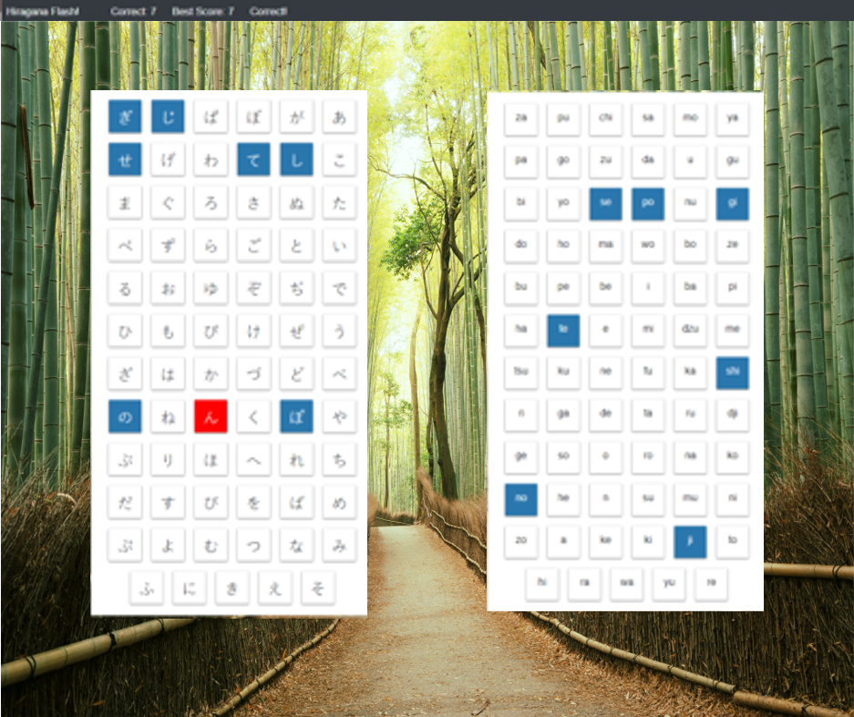

# Hiragana-flashcards
## A React Clicky Game

This project to create a React application memory game, challenging users to match Japanese Hiragana characters with the English pronunciation.

Try the demo [here]()

## Technology Used:

* CSS3/HTML5
* Javascript/JSX/ES6
* Bootstrap
* Node/Express
* NPM/Yarn
* React

## Original Assignment:

## Clicky Game

## Overview

For this assignment, you'll create a memory game with React. This assignment will require you to break up your application's UI into components, manage component state, and respond to user events.

### Instructions

1. Check out the example solution and study the app's basic functionality.
2. Create a new React application.
3. The application should render different images (of your choice) to the screen. Each image should listen for click events.
4. The application should keep track of the user's score. The user's score should be incremented when clicking an image for the first time. The user's score should be reset to 0 if they click the same image more than once.
5. Every time an image is clicked, the images rendered to the page should shuffle themselves in a random order.
6. Once the user's score is reset after an incorrect guess, the game should restart.
7. When complete, the application should be deployed to Github Pages. See the README generated with Create React App for instructions on deploying the application to Github Pages.

